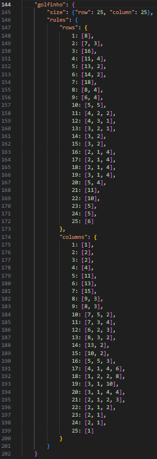
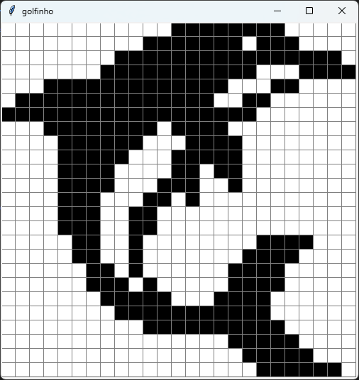

# Solver-Nonogram


## Sobre o Trabalho

O Solver foi desenvolvido como trabalho de conclusão para a disciplina de **Lógica para Computação**, , ministrada pelo Prof. Dr. Alexandre Matos Arruda, na Universidade Federal do Ceará (UFC).

O objetivo é demonstrar a aplicação de redução de problemas para SAT. O programa recebe as regras numéricas das linhas e colunas de um nonogram, gera as cláusulas lógicas correspondentes em FNC (Forma Normal Conjuntiva) e utiliza um SAT Solver para deduzir quais células devem ser pintadas.


## Funções

- Geração de Possibilidades: Algoritmo combinatório que calcula todas as disposições válidas para uma linha ou coluna dado um conjunto de regras.

- Modelagem SAT: Conversão das restrições do quebra-cabeça (unicidade de escolha por linha/coluna e consistência da grade) para cláusulas lógicas.

- Solver Integrado: Utilização do Glucose4 para resolução eficiente.

- Visualização Gráfica: Interface construída com tkinter para desenhar o resultado final.

- Exemplos Inclusos: O código já conta com configurações de teste para desenhos como Mario, Creeper, Coração, Hollow Knight e um Golfinho.


## Tecnologias Utilizadas

- Python 3

- Python-SAT (pysat): Para a resolução lógica (Glucose4).

- Tkinter: Para a interface gráfica (nativo do Python).


## Requisitos

É necessário ter o Python instalado e a biblioteca python-sat. Você pode instalá-la via pip:
  ```pip install python-sat```
  

## Rodando o Solver
- Clone este repositório.

- Abra o arquivo main.py.

- Descomente a linha correspondente ao desenho que deseja resolver (ex: nome_do_desenho = "hollow_knight").

- Execute o arquivo:
  ```python main.py```

## Regras e Desenho




## Autor

Feito por **[Artur Saraiva Rabelo](https://github.com/artur-sres)**.
